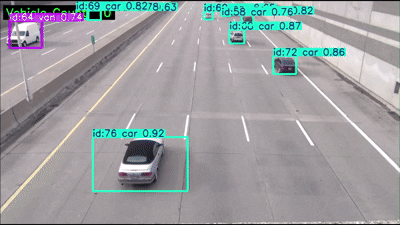
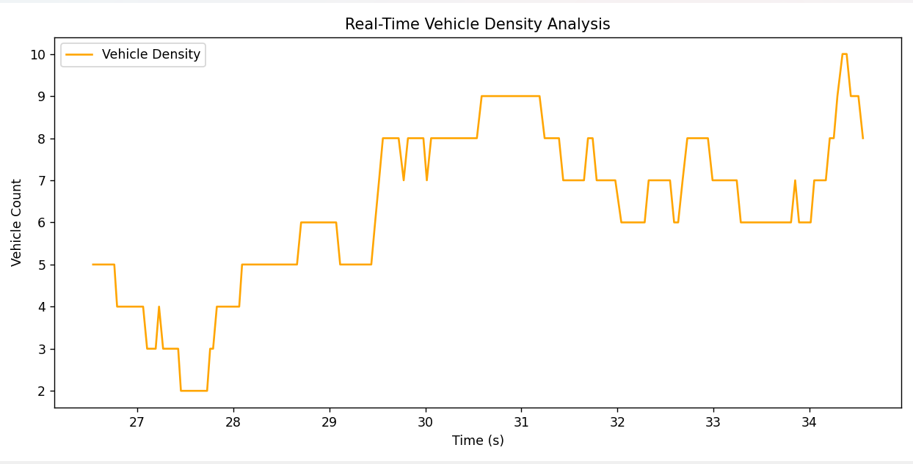

# 🚗 GERÇEK ZAMANLI ARAÇ YOĞUNLUĞU ANALİZİ SİSTEMİ (YOLOv8 + ByteTrack)





---

## 🎯 PROJENİN AMACI VE KONUSU

Bu proje, **YOLOv8** nesne tespiti ve **ByteTrack** takip algoritmasını kullanarak video veya canlı kamera akışlarında **araç yoğunluğunu gerçek zamanlı** olarak analiz eden bir sistemdir.  
Sistemin amacı, şehir içi trafik izleme, yoğunluk tespiti, savunma sistemleri veya akıllı ulaşım çözümleri gibi alanlarda **araç hareketlerini tespit etmek**, **yalnızca araç sınıflarını (car, bus, truck, van, motor vb.) saymak** ve **zaman içindeki trafik yoğunluğunu grafiksel olarak göstermek**tir.  

Proje, görüntü işleme, nesne takibi, veri analizi ve görselleştirme kavramlarını tek bir yapay zekâ pipeline’ında birleştirir.  
İnsan, yaya gibi sınıflar hariç tutulur, sadece araçlar analiz edilir.  

---

## ⚙️ PROJE ÇALIŞMA MANTIĞI

1. **YOLOv8 modeli**, her karede araçları tespit eder.  
2. **ByteTrack algoritması**, tespit edilen araçlara benzersiz kimlik (ID) atayarak takip eder.  
3. Her karedeki toplam araç sayısı ekrana yazılır.  
4. Süre boyunca elde edilen araç sayısı değerleri kaydedilir ve **yoğunluk grafiği** oluşturulur.  
5. İşlem tamamlandığında grafik gösterilir.  

---

## 🧠 PROJEDE KULLANILAN TEKNOLOJİLER

| Teknoloji | Amaç |
|------------|------|
| **Python 3.9+** | Ana programlama dili |
| **Ultralytics YOLOv8** | Nesne tespiti (Object Detection) |
| **ByteTrack** | Nesne takibi (Object Tracking) |
| **OpenCV** | Görüntü işleme ve video okuma |
| **Matplotlib** | Yoğunluk grafiği oluşturma |
| **Deque (collections)** | Zaman serisi verilerini tutma |

---

## 🧩 PROJE DİZİN YAPISI

```
project_root/
├── app.py                         # Ana çalıştırılabilir dosya
├── weights/
│   └── best.pt                    # Eğitilmiş YOLO modeli
├── test_videos/
│   └── cars.mp4                   # Test videosu
├── output.gif                     # Ana dizindeki demo GIF
├── image.png                      # Ana dizindeki yoğunluk grafiği
├── src/
│   ├── tracker.py                 # YOLO + ByteTrack işlemleri
│   ├── density_analyzer.py        # Araç sayımı ve yoğunluk grafiği
│   ├── utils.py                   # Görüntü üzerine yazı ve ROI çizimi
│   └── config.py                  # Model ve video yolu ayarları
└── ultralytics/
    └── cfg/tracker/bytetrack.yaml # Takip algoritması yapılandırması
```

---

## 🚀 KURULUM VE ÇALIŞTIRMA ADIMLARI

### 1️⃣ Gerekli kütüphaneleri yükle:
```bash
pip install ultralytics==8.0.196 opencv-python matplotlib numpy
```

### 2️⃣ Modeli ekle:
Eğitilmiş YOLOv8 modelini `weights/best.pt` olarak yerleştir.

### 3️⃣ Videoyu ekle:
Analiz etmek istediğin videoyu `test_videos/` klasörüne koy (örnek: `cars.mp4`).

### 4️⃣ Uygulamayı çalıştır:
```bash
python app.py
```

### 5️⃣ Sonuç:
- Ekranda anlık **araç sayısı** gösterilir.  
- Araç tespitleri kare üzerine çizilir.  
- İşlem tamamlanınca **yoğunluk grafiği** açılır.  
- İşlenen video `output/output_result.mp4` olarak kaydedilir.  

---

## 🧠 PROJE ÖZELLİKLERİ

- 🚘 Gerçek zamanlı nesne tespiti ve takibi  
- 🧮 Araç sınıflarının sayılması (yaya hariç)  
- 📊 Zaman serisi tabanlı yoğunluk grafiği  
- 🎥 Çıktı videosu ve otomatik demo GIF oluşturma  
- 🖼️ Arka planı renkli sayaç yazısı (görünürlük için optimize)  
- ⚙️ Tamamen modüler yapı (`src/` klasörü altında)  

---
